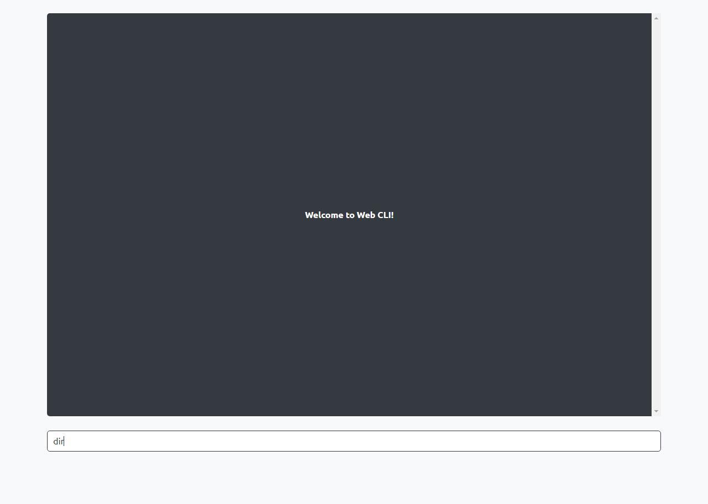
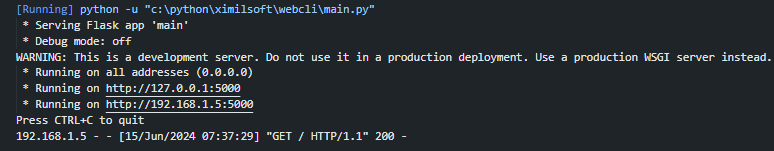

# WebCLI

Control your computer's CLI from the browser on any device within your network (desktop, mobile).



## Installation

1. Clone the repository or download it:

   ```shell
   git clone https://github.com/ximilsoft/webcli
   ```

2. Navigate to the project directory:

   ```shell
   cd webcli
   ```

3. Install project dependencies:

   ```shell
   pip install -r requirements.txt
   ```

3. Update python interpreter path:

   ```python
   python_executable = 'C:\\Users\\lProfesseur\\AppData\\Local\\Programs\\Python\\Python38\\python.exe'
   ```

4. Run `main.py`

   ```shell
   python main.py
   ```
5. Enter the WebCLI

Now, you can enter using the links.



## Getting Help

If you have any questions or need assistance, feel free to [open an issue](https://github.com/ximilsoft/webcli/issues).

## Contributing

If you have an idea for a new feature or want to improve existing ones, check out [contributing.md](CONTRIBUTING.md) for more information.

## Roadmap
- [x] Basic Functionalities.
- [ ] Improving command answers.
- [ ] Controling many CLIs.

## Support

If you find this project helpful, show your support by starring the repository.